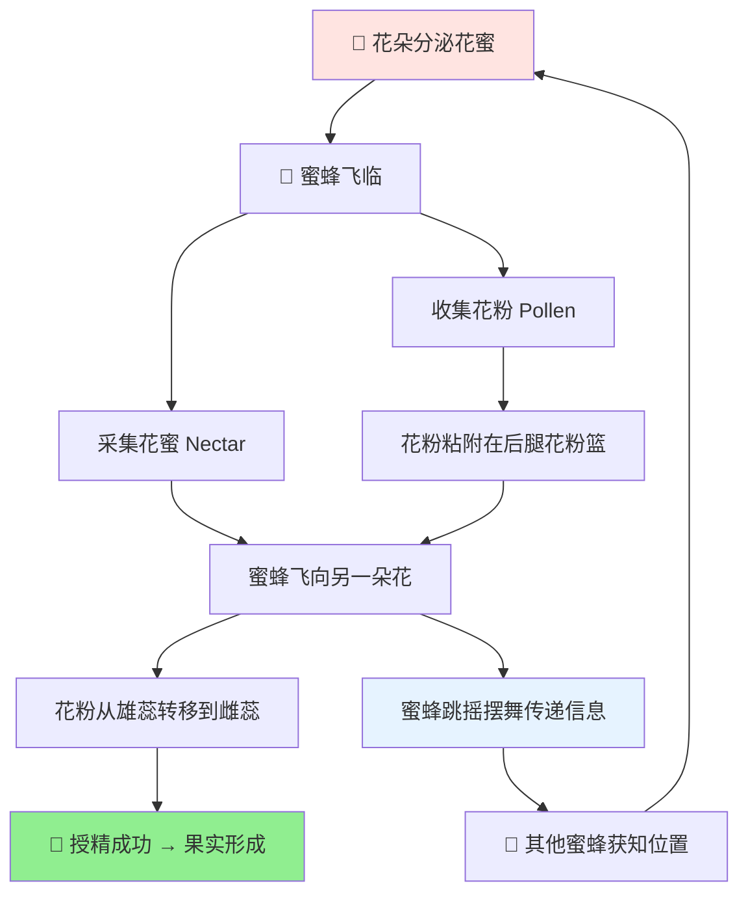
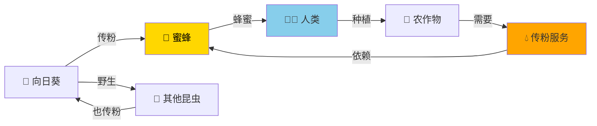
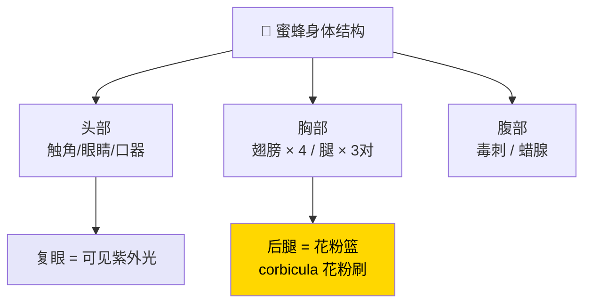

# 🐝 蜜蜂传粉 — Mermaid 流程图

> 可直接复制到 Obsidian / GitHub README 中渲染

---

## 传粉过程总览

```mermaid
graph TD
    A[🌸 花朵分泌花蜜] --> B[🐝 蜜蜂飞临]
    B --> C[采集花蜜 Nectar]
    B --> D[收集花粉 Pollen]
    D --> E[花粉粘附在后腿花粉篮]
    C --> F[蜜蜂飞向另一朵花]
    E --> F
    F --> G[花粉从雄蕊转移到雌蕊]
    G --> H[🌱 授精成功 → 果实形成]
    F --> I[蜜蜂跳摇摆舞传递信息]
    I --> J[🐝 其他蜜蜂获知位置]
    J --> A

    style A fill:#FFE4E1
    style H fill:#90EE90
    style I fill:#E6F3FF
```

---

## 生态链关系图

```mermaid
graph LR
    A[🌻 向日葵] -->|传粉| B[🐝 蜜蜂]
    B -->|蜂蜜| C[👨‍🌾 人类]
    C -->|种植| D[🌾 农作物]
    D -->|需要| E[💧 传粉服务]
    E -->|依赖| B
    A -->|野生| F[🦋 其他昆虫]
    F -->|也传粉| A
    
    style B fill:#FFD700,color:#000
    style C fill:#87CEEB
    style E fill:#FFA500
```

---

## 蜜蜂身体结构（传粉相关）

```mermaid
graph TD
    A[🐝 蜜蜂身体结构] --> B[头部<br/>触角/眼睛/口器]
    A --> C[胸部<br/>翅膀 × 4 / 腿 × 3对]
    A --> D[腹部<br/>毒刺 / 蜡腺]
    
    C --> C1[后腿 = 花粉篮<br/>corbicula 花粉刷]
    B --> B1[复眼 = 可见紫外光]
    
    style C1 fill:#FFD700,color:#000
    style B1 fill:#E6E6FA
```

---

*📅 生成：2026-07-13 | QClaw*
