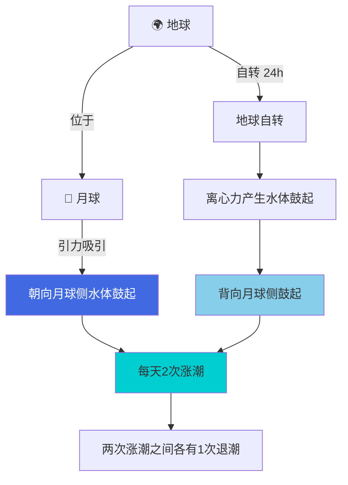
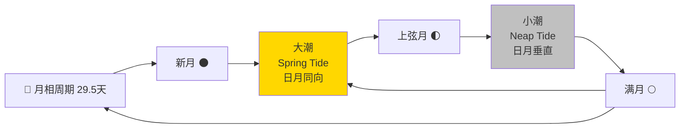
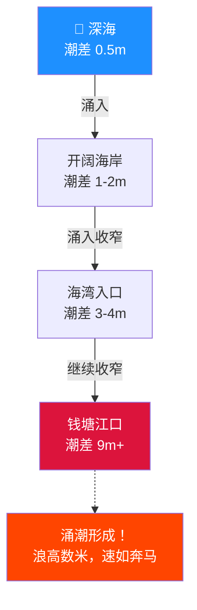
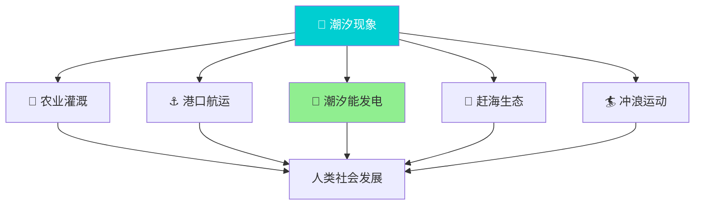

# 🌊 潮汐机制 — Mermaid 流程图

> 可直接复制到 Obsidian / GitHub README 中渲染

---

## 潮汐形成原理

```mermaid
graph TD
    A[🌍 地球] -->|自转 24h| B[地球自转]
    A -->|位于| C[🌙 月球]
    
    B --> D[离心力产生水体鼓起]
    C -->|引力吸引| E[朝向月球侧水体鼓起]
    
    D --> F[背向月球侧鼓起]
    E --> G[每天2次涨潮]
    F --> G
    G --> H[两次涨潮之间各有1次退潮]
    
    style E fill:#4169E1,color:#fff
    style F fill:#87CEEB
    style G fill:#00CED1
```

---

## 大潮与小潮周期

```mermaid
graph LR
    A[🌙 月相周期 29.5天] --> B[新月 🌑]
    B --> C[大潮<br/>Spring Tide<br/>日月同向]
    C --> D[上弦月 🌓]
    D --> E[小潮<br/>Neap Tide<br/>日月垂直]
    E --> F[满月 🌕]
    F --> C
    F --> A
    
    style C fill:#FFD700
    style E fill:#C0C0C0
```

---

## 喇叭形海湾潮差放大原理

```mermaid
graph TD
    A[🌊 深海<br/>潮差 0.5m] -->|涌入| B[开阔海岸<br/>潮差 1-2m]
    B -->|涌入收窄| C[海湾入口<br/>潮差 3-4m]
    C -->|继续收窄| D[钱塘江口<br/>潮差 9m+]
    
    D -.-> E[涌潮形成！<br/>浪高数米，速如奔马]
    
    style A fill:#1E90FF,color:#fff
    style D fill:#DC143C,color:#fff
    style E fill:#FF4500,color:#fff
```

---

## 潮汐与人类生活

```mermaid
graph TD
    A[🌊 潮汐现象] --> B[🌾 农业灌溉]
    A --> C[⚓ 港口航运]
    A --> D[🔋 潮汐能发电]
    A --> E[🦀 赶海生态]
    A --> F[🏄 冲浪运动]
    
    B --> G[人类社会发展]
    C --> G
    D --> G
    E --> G
    F --> G
    
    style D fill:#90EE90
    style A fill:#00CED1,color:#fff
```

---

*📅 生成：2026-07-13 | QClaw*
